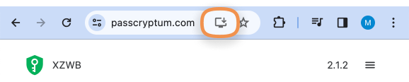

# General

## Run standalone offline application

To run the Passcryptum mobile or desktop offline application:

* Either you have or not a Passcryptum account, use the [PWA method](#pwa-method).
* If you have a [Passcryptum account](../overview/glossary.md#passcryptum-account), use the [Existing account](#existing-account) instruction.
* If you don’t have a Passcryptum account, use the [Non-existing account](#non-existing-account) instruction.

### PWA method

Progressive Web Application (PWA) is a way to run the Passcryptum without transferring the services’ data.

To run the application:

1. [Log in the Passcryptum](general.md#log-in-passcryptum).
1. In the address bar, click the PWA icon.

    

1. In the <b>Install app?</b> popup, click <b>Install</b>.

    

The application will open in a new window.

### Existing account

1. Complete the [Get started](../overview/get-started.md) instruction.
1. [Export services](storage.md#export-services) from the web application. The file will be downloaded.
1. Transfer the downloaded file to the mobile or desktop device.
1. Download the `passcryptum.html` file from the [releases](https://github.com/nelkor/passcryptum/releases) section.
1. Open the file in a browser by double-clicking it.
1. [Import services](storage.md#import-services) on the mobile or desktop device.

### Non-existing account

1. Download the `passcryptum.html` file from the [releases](https://github.com/nelkor/passcryptum/releases) section.
1. Open the file in a browser by double-clicking it.

## Log in Passcryptum

### Web application

1. Go to the [Passcryptum page](https://passcryptum.com/).
1. Click the <b>Password</b> tab.
1. Enter the [origin password](../overview/glossary.md#origin-password).
1. Click <b>Continue</b>.

### PWA method {#log-in-pwa-method}

1. [Run the PWA method](#pwa-method).
1. Click the <b>Password</b> tab.
1. Enter the [origin password](../overview/glossary.md#origin-password).
1. Click <b>Continue</b>.

### Mobile and desktop offline application

1. [Run standalone offline application](#run-standalone-offline-application).
1. Click the <b>Password</b> tab.
1. Enter the [origin password](../overview/glossary.md#origin-password).
1. Click <b>Continue</b>.

## Sign out Passcryptum

1. [Log in the Passcryptum](#log-in-passcryptum).
1. Click the <b>≡</b> icon.
1. In the drop-down menu, click <b>Sign out</b>.

